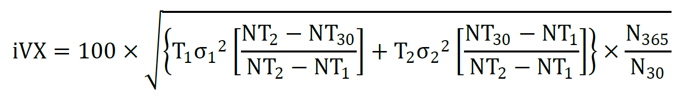
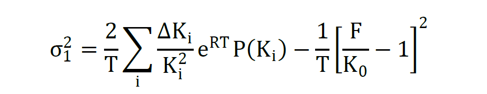
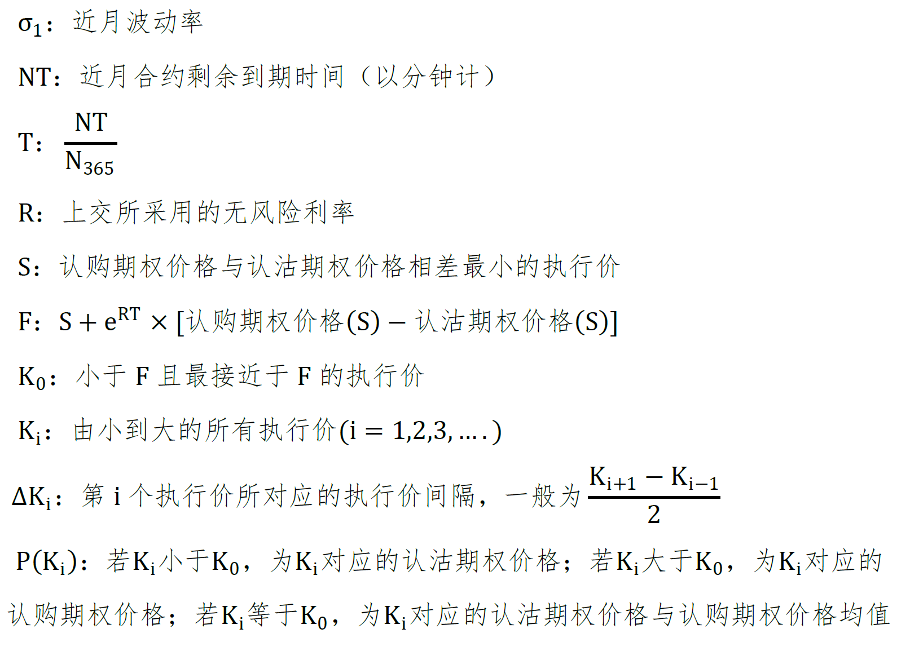
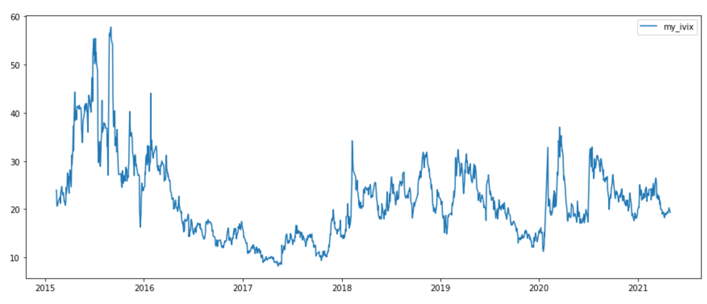
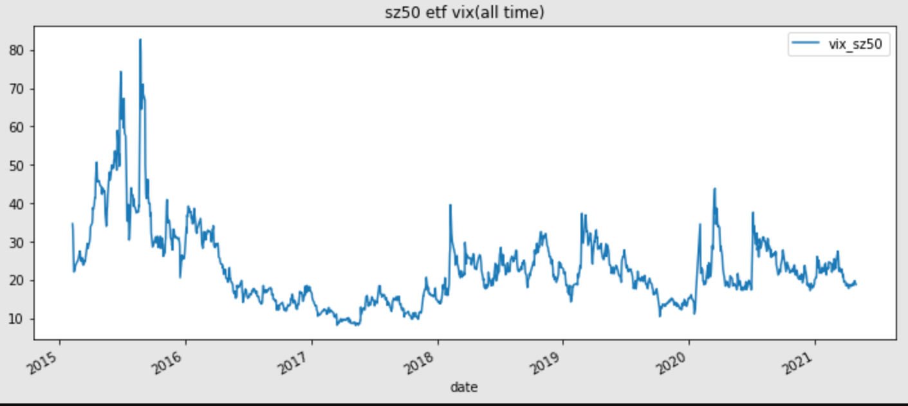
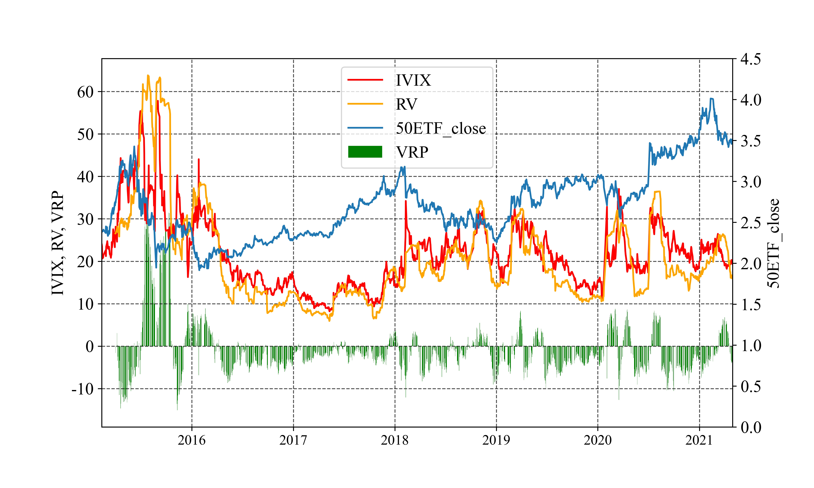

# 计算中国波指IVIX

## IVIX计算公式：

## 数据来源

计算IVIX所用到的SHIBOR和期权价格完全来自tushare

ivixx.csv是真实的IVIX报价，来自WIND数据库

### 变量说明：

**关于期权价格**

* 首先筛选出剩余期限大于7天的合于
* 应该根据期权是否成交，基于特定规则从买价和卖价中推算期权价格。由于数据限制直接用tushare提供的期权收盘价作为代替。

**关于公式中的变量（从IVIX白皮书抄来的）**

注1：次近月波动率算法与近月波动率算法一致

注2：当特殊行情导致执行价覆盖不充分时，用BS公式填充部分虚拟行权价合约，并带入近月和次近月波动率的计算

注3：当近月合约剩余期限大于30天时，直接用近月波动率乘以100作为IVIX

## 结果分析

用该程序算出来的IVIX和上海纽约大学波动率研究所计算结果在趋势上比较一致，数值上有所差异。

总而言之，用这段代码粗糙计算看看波动率大概走势，或者顺手做点小实证应该没啥大问题。。。

* 我算的

* 上海纽约大学波动率研究所算的

* 我算的波动率风险溢价（Volatility Risk Premium）

可以发现波动率风险溢价大多小于零，且IVIX与50ETF收盘价呈正相关，符合中国市场现状。
